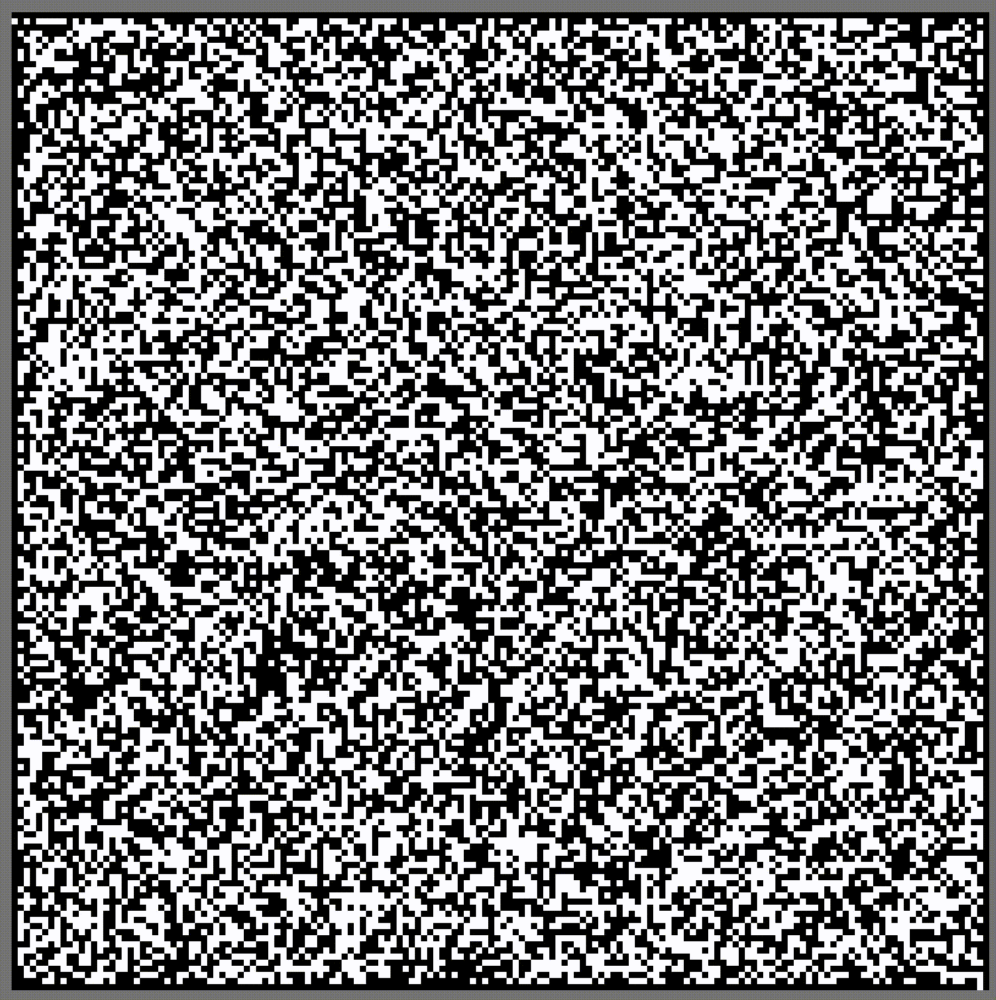

# Maze Generator With Cellular Automaton

##Introduction

This an old project I used as an HelloWorld for my gitHub.
It was in 2020 when I was learning Java. I had an homework wich was to creat a maze generator. I came up whith solutinon using a [Cellular automaton](https://en.wikipedia.org/wiki/Cellular_automaton)(Also called CA) inspired by the [Conway's Game of Life](https://en.wikipedia.org/wiki/Conway%27s_Game_of_Life). After going back on the project and doing some reasearch on the subject I discovered half of my solution was already existing. I created this repository to share this fun aproach of maze generator.
 

## Algoritme
The CA begin whith a randomized grid. Black cells are walls and the white ones are coridores. The edges of this grid are walls excepte for one exit and one entrence. Then the CA starts and organize the randomize grid in a acceptable maze parterns. After a certain amout of iterations the CA stops giving the resulting maze.

  

## Neighborhood
This cellular automaton use 2 different neighborhoods.
The first one is a classical [Von Neumann Neighborhood](https://en.wikipedia.org/wiki/Von_Neumann_neighborhood).

## The Rules

## Usage

## Acknowledgments

[View Conway's Game of Life project in Java by someone else](https://github.com/leonpetrinos/GameOfLifeJavaFX)

